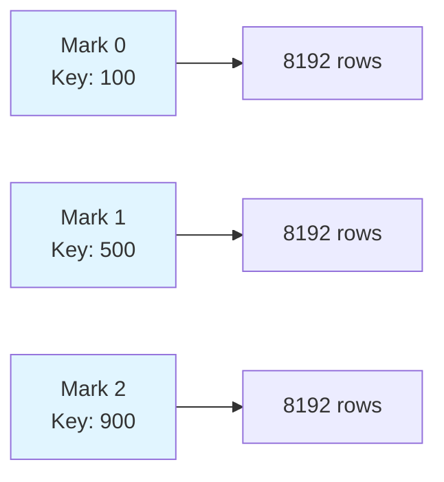
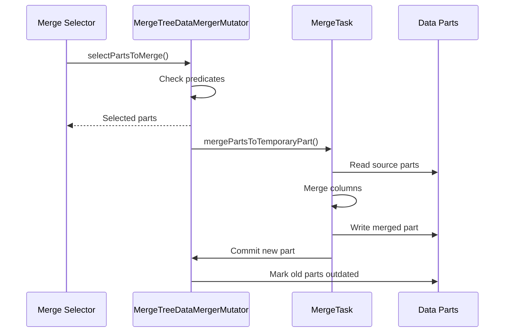

ClickHouse's storage architecture is built around the MergeTree engine family, which implements a column-oriented storage model with sophisticated data organization and background optimization.

## Column-Oriented Storage

### Storage Layout

Data in ClickHouse is stored column-by-column rather than row-by-row. Each column is stored in separate files on disk, allowing:

- **Selective column reading**: Only required columns are loaded into memory
- **Better compression**: Similar values compress more efficiently
- **Cache efficiency**: Sequential access patterns for analytical queries

The column files are managed by `IDataPartStorage` interface (`src/Storages/MergeTree/IDataPartStorage.h`) with concrete implementations like `DataPartStorageOnDiskFull` (`src/Storages/MergeTree/DataPartStorageOnDiskFull.h`).

### File Structure

Each data part consists of multiple files:

- **`*.bin`**: Column data files (defined as `DATA_FILE_EXTENSION` in `src/Storages/MergeTree/IMergeTreeDataPart.h:81`)
- **`*.mrk` or `*.mrk2`**: Mark files containing offset information
- **`primary.idx`**: Primary key index file
- **`count.txt`**: Row count metadata
- **`checksums.txt`**: File checksums for integrity verification
- **`columns.txt`**: Column metadata

## MergeTree Data Parts

### Data Part Lifecycle

A data part is an immutable unit of data storage. The `IMergeTreeDataPart` class (`src/Storages/MergeTree/IMergeTreeDataPart.h`) represents each part:

```cpp
// From src/Storages/MergeTree/IMergeTreeDataPart.h:75-78
/// Description of the data part.
/// Warning: `IStorage` must outlive all its `IMergeTreeDataPart`s.
class IMergeTreeDataPart : public std::enable_shared_from_this<IMergeTreeDataPart>
```

<Warning>
Data parts must never outlive their parent storage. Always hold a `StoragePtr` when holding a `MergeTreeDataPartPtr`.
</Warning>

### Part States

Data parts transition through several states defined in `MergeTreeDataPartState` (`src/Storages/MergeTree/MergeTreeDataPartState.h`):

- **Temporary**: Being created, not yet visible
- **PreActive**: Prepared but not committed
- **Active**: Available for queries
- **Outdated**: Superseded by merged part
- **Deleting**: Scheduled for removal

### Part Naming Convention

Parts are named according to their content using `MergeTreePartInfo` (`src/Storages/MergeTree/MergeTreePartInfo.h`):

```text
PartitionID_MinBlock_MaxBlock_Level
```

Example: `202403_1_100_2`
- Partition: `202403`
- Block range: `1` to `100`
- Merge level: `2` (how many times the data has been merged)

## Active Data Part Set

The `ActiveDataPartSet` class (`src/Storages/MergeTree/ActiveDataPartSet.h`) maintains the set of currently active parts:

- Tracks which parts are visible to queries
- Handles part versioning and superseding
- Ensures consistency during concurrent operations

<Info>
The invariant `virtual_parts = current_parts + queue` is maintained by the system, where virtual parts represent the expected state after all queued operations complete.
</Info>

## Data Organization

### Partitioning

Data is divided into partitions based on the `PARTITION BY` expression. Each partition:

- Contains its own set of data parts
- Can be manipulated independently (DROP PARTITION, ATTACH PARTITION)
- Enables efficient data management for time-series workloads

Partition information is managed by `MergeTreePartition` (`src/Storages/MergeTree/MergeTreePartition.h`).

### Primary Key Index

ClickHouse uses a sparse primary index:

- Stores values for every `index_granularity` rows (default 8192)
- Managed by `MergeTreeIndexGranularity` (`src/Storages/MergeTree/MergeTreeIndexGranularity.h`)
- Enables efficient range queries and filtering



### Data Compression

Columns are compressed using various codecs:

- **LZ4**: Fast compression (default)
- **ZSTD**: Better compression ratio
- **Delta**: For sequential values
- **DoubleDelta**: For timestamps
- **Gorilla**: For floating-point data
- **Bitpacking**: Implemented in `BitpackingBlockCodec.h`

Compression is applied at the granule level, allowing decompression of only required data ranges.

## Merge Operations

### Why Merge?

As data is inserted, multiple small parts are created. Merging combines these into larger parts to:

- Reduce the number of parts (improves query performance)
- Apply mutations and deletions
- Optimize data layout
- Enforce TTL (Time-To-Live) policies

### Merge Process

Merges are coordinated by `MergeTreeDataMergerMutator` (`src/Storages/MergeTree/MergeTreeDataMergerMutator.h`):

```cpp
// From src/Storages/MergeTree/MergeTreeDataMergerMutator.h:29-31
/** Can select parts for background processes and do them.
 * Currently helps with merges, mutations and moves
 */
class MergeTreeDataMergerMutator
```

#### Merge Selection

The system uses heuristics to select parts for merging:

1. **Part size**: Prefer merging similarly-sized parts
2. **Partition**: Only merge within same partition
3. **Block range**: Ensure no gaps in block number ranges
4. **Available resources**: Consider disk space and system load

Implemented in `selectPartsToMerge` method (`src/Storages/MergeTree/MergeTreeDataMergerMutator.h:54`).

#### Merge Execution



### Merge Selectors

Different merge strategies are available in `src/Storages/MergeTree/Compaction/MergeSelectors/`:

- **`SimpleMergeSelector`**: Basic size-based selection
- **`TTLMergeSelector`**: Prioritizes parts with expired TTL
- **`AllMergeSelector`**: For OPTIMIZE FINAL operations

Implemented through the `IMergeSelector` interface.

### Merge Predicates

Merge predicates determine whether a merge is allowed:

- **`MergeTreeMergePredicate`**: For standalone MergeTree
- **`ReplicatedMergeTreeMergePredicate`**: For replicated tables
- **`DistributedMergePredicate`**: Coordinates across replicas

Defined in `src/Storages/MergeTree/Compaction/MergePredicates/`.

<Note>
Merge predicates coordinate with inserts and other operations to ensure parts between which another part can still appear are not merged (prevents METR-7001 issue).
</Note>

## Part Storage and I/O

### Storage Policies

ClickHouse supports multi-disk storage through `StoragePolicy` (`src/Disks/StoragePolicy.h`):

- **Volumes**: Logical grouping of disks
- **Move rules**: Automatic part movement between volumes
- **TTL-based moves**: Move old data to cold storage

Managed by `MergeTreePartsMover` (`src/Storages/MergeTree/MergeTreePartsMover.h`).

### Part Reader and Writer

- **`IMergeTreeReader`** (`src/Storages/MergeTree/IMergeTreeReader.h`): Reads column data from parts
- **`IMergeTreeDataPartWriter`** (`src/Storages/MergeTree/IMergeTreeDataPartWriter.h`): Writes new parts to disk

These handle:
- Column serialization/deserialization
- Mark file generation
- Checksum calculation
- Compression/decompression

## Checksums and Integrity

Data integrity is ensured through `MergeTreeDataPartChecksums` (`src/Storages/MergeTree/MergeTreeDataPartChecksum.h`):

- Each file has a checksum stored in `checksums.txt`
- Verified on part load and during background checks
- Detects silent data corruption

## Performance Optimizations

### Granule-Level Operations

Data is processed in granules (default 8192 rows):
- Minimum read unit
- Compression boundary
- Index entry spacing

Configured via `MergeTreeIndexGranularity` and `MergeTreeIndexGranularityInfo`.

### Column Substreams

Complex types (Arrays, Nested, Nullable) are split into substreams:

- Each substream stored in separate files
- Allows selective reading of type components
- Managed by `ColumnsSubstreams` (`src/Storages/MergeTree/ColumnsSubstreams.h`)

### Serialization Info

The system tracks serialization statistics in `SerializationInfo` to optimize:
- Default value storage
- Nullable column handling
- Sparse column encoding

## Related Files

Key source files for data storage:

- `src/Storages/MergeTree/MergeTreeData.h` - Main storage class
- `src/Storages/MergeTree/IMergeTreeDataPart.h` - Data part representation
- `src/Storages/MergeTree/MergeTreeDataMergerMutator.h` - Merge coordination
- `src/Storages/MergeTree/ActiveDataPartSet.h` - Active part tracking
- `src/Storages/MergeTree/MergeTreeDataSelectExecutor.h` - Query execution
