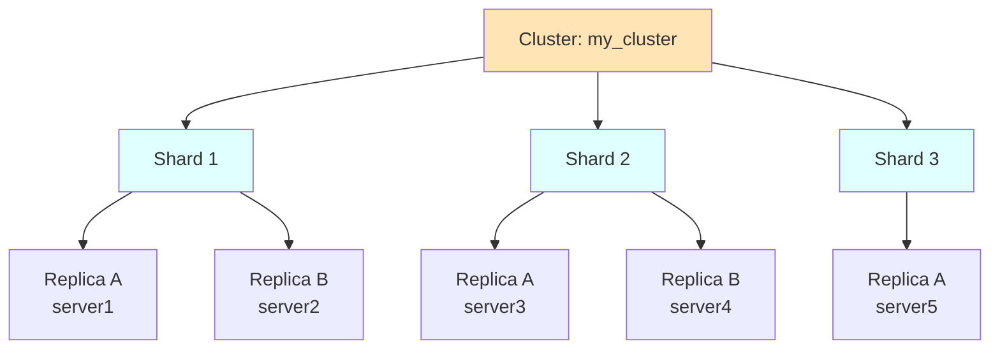
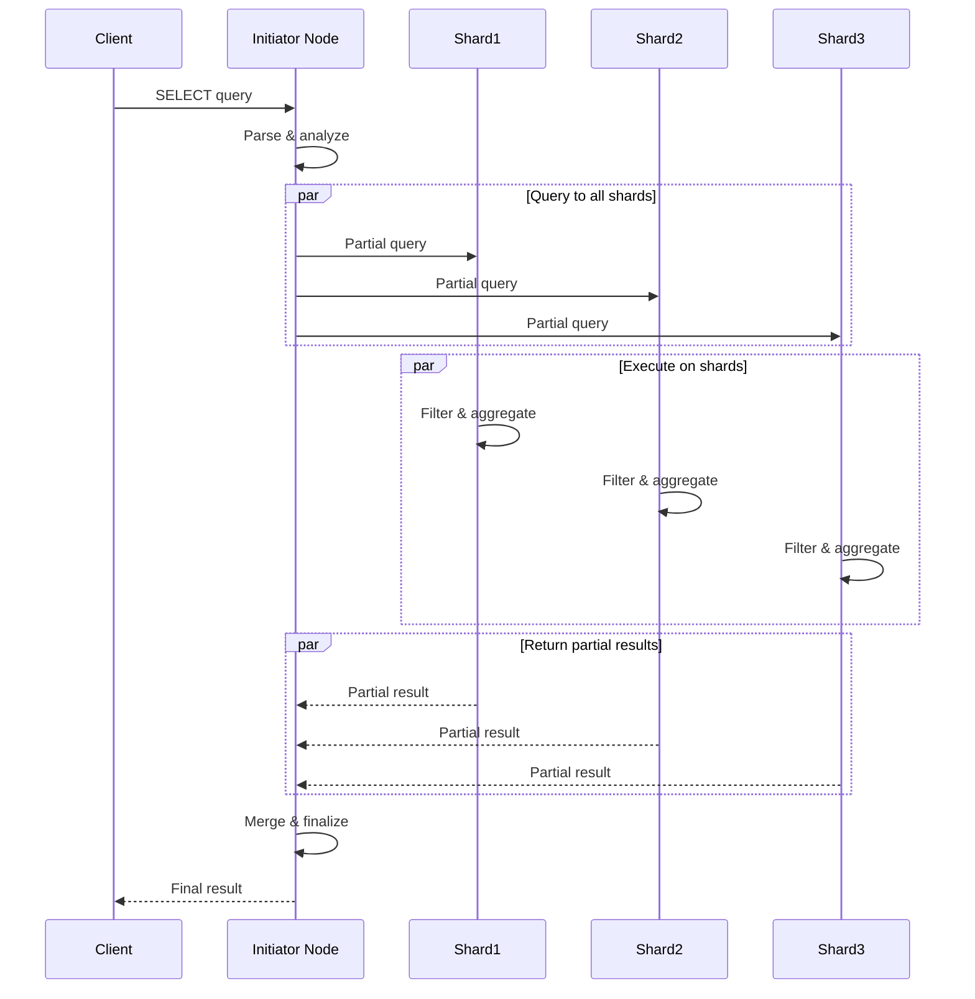

ClickHouse's distributed query capabilities enable horizontal scaling by distributing data and computation across multiple nodes. The `Distributed` table engine provides a unified interface to query sharded data.

## Distributed Table Overview

### StorageDistributed

The `StorageDistributed` class (`src/Storages/StorageDistributed.h`) implements distributed table functionality:

```cpp
// From src/Storages/StorageDistributed.h:39-44
/** A distributed table that resides on multiple servers.
  * Uses data from the specified database and tables on each server.
  *
  * You can pass one address, not several.
  * In this case, the table can be considered remote, rather than distributed.
  */
class StorageDistributed final : public IStorage, WithContext
```

Key characteristics:

- **Virtual table**: No data stored locally (usually)
- **Query distribution**: Forwards queries to cluster nodes
- **Result aggregation**: Combines results from multiple shards
- **Async inserts**: Optional buffering of INSERT data

<Note>
A distributed table can represent a single remote server (remote table) or multiple servers (truly distributed).
</Note>

## Cluster Architecture

### Cluster Configuration

Clusters are defined in configuration and accessed through the `Cluster` class (`src/Interpreters/Cluster.h`):

```xml
<remote_servers>
    <my_cluster>
        <shard>
            <replica>
                <host>server1</host>
                <port>9000</port>
            </replica>
            <replica>
                <host>server2</host>
                <port>9000</port>
            </replica>
        </shard>
        <shard>
            <replica>
                <host>server3</host>
                <port>9000</port>
            </replica>
        </shard>
    </my_cluster>
</remote_servers>
```

### Cluster Components

- **Shards**: Horizontal partitions of data (no overlap)
- **Replicas**: Copies of shard data (for redundancy)
- **Cluster**: Named group of shards and replicas



## Sharding Strategies

### Sharding Key

Data distribution is controlled by the sharding key (from `src/Storages/StorageDistributed.h:62`):

```cpp
StorageDistributed(
    const StorageID & id_,
    const ColumnsDescription & columns_,
    // ...
    const ASTPtr & sharding_key_,  // Determines data distribution
    // ...
);
```

Common sharding strategies:

1. **Hash-based**: `rand()` or `cityHash64(user_id) % num_shards`
2. **Range-based**: `intDiv(event_date, 7)` for weekly shards
3. **Explicit**: Direct shard number specification

### Insert Distribution

When inserting into a distributed table:

1. Evaluate sharding key for each row
2. Group rows by target shard
3. Send batches to corresponding shards
4. Each shard inserts into local table

Handled by `DistributedSink` (`src/Storages/Distributed/DistributedSink.h`).

### Async Insert Mode

For high-throughput inserts, data can be buffered locally:

- Written to local directory (`DistributedAsyncInsertDirectoryQueue`)
- Sent to shards in background batches
- Improves insert performance
- Risk of data loss on node failure

Managed by:
- `DistributedAsyncInsertDirectoryQueue.h`
- `DistributedAsyncInsertBatch.h`
- `DistributedAsyncInsertHelpers.h`

<Warning>
Async inserts provide better performance but may lose data if the initiator node fails before sending buffered data. Use synchronous inserts for critical data.
</Warning>

## Distributed Query Execution

### Query Processing Stages

Distributed queries are processed in stages defined by `QueryProcessingStage` (`src/Core/QueryProcessingStage.h`):

```cpp
enum class Enum
{
    FetchColumns,          // Read columns from storage
    WithMergeableState,    // Partial aggregation/sorting
    Complete,              // Final result
};
```

The `getQueryProcessingStage` method (`src/Storages/StorageDistributed.h:90-91`) determines how much processing happens on each shard.

### Two-Phase Query Execution

Typical distributed query flow:



### Stage 1: Shard Execution

Each shard executes:

1. **Filter**: Apply WHERE conditions
2. **Partial aggregation**: GROUP BY with partial states
3. **Partial sorting**: ORDER BY (if needed)
4. **Limit pushdown**: Apply preliminary LIMIT

### Stage 2: Initiator Merging

The initiator node:

1. **Receives** partial results from shards
2. **Merges** aggregation states
3. **Finalizes** aggregate functions
4. **Sorts** final result (if needed)
5. **Applies** final LIMIT and OFFSET

## Query Optimizations

### GLOBAL IN/JOIN

For `IN` and `JOIN` with small right-hand tables:

```sql
-- Regular IN: subquery executed on each shard independently
SELECT * FROM distributed_table WHERE user_id IN (SELECT id FROM users);

-- GLOBAL IN: subquery executed once, result broadcasted
SELECT * FROM distributed_table WHERE user_id GLOBAL IN (SELECT id FROM users);
```

With `GLOBAL`:
1. Initiator executes subquery
2. Result stored in temporary table
3. Temporary table broadcasted to all shards
4. Shards use broadcasted data

<Info>
Use `GLOBAL` when the right-hand side is small and the left-hand side is large and distributed.
</Info>

### Local Query Optimization

If query only needs data from local shard:

- Detect through sharding key analysis
- Execute locally without network overhead
- Automatic optimization by query planner

### Parallel Replica Reading

Within a shard, multiple replicas can read in parallel:

- Enabled with `parallel_replicas` setting
- Each replica reads a subset of marks
- Results merged on initiator
- Improves query performance for large datasets

## Connection Management

### Connection Pools

Connections to shards are managed through `ConnectionPoolWithFailover` (`src/Storages/StorageDistributed.h:34-35`):

- Maintains connections to all replicas
- Automatic failover on connection failure
- Load balancing across replicas
- Connection reuse for multiple queries

### Replica Selection

Replicas are chosen based on:

1. **Random**: Default, distributes load evenly
2. **Nearest hostname**: Prefer local replicas
3. **In order**: Use first available replica
4. **First or random**: Try first, fallback to random

Configured per query or cluster.

## Distributed Table Features

### Capabilities

From `src/Storages/StorageDistributed.h:75-79`:

```cpp
bool supportsSampling() const override { return true; }
bool supportsFinal() const override { return true; }
bool supportsPrewhere() const override { return true; }
bool supportsSubcolumns() const override { return true; }
bool supportsDynamicSubcolumns() const override { return true; }
```

Distributed tables support:
- **Sampling**: `SAMPLE` clause for approximate queries
- **Final modifier**: `FINAL` for deduplicated reads
- **Prewhere**: Filter optimization (delegated to shards)
- **Subcolumns**: Nested and dynamic subcolumn access

### Limitations

From `src/Storages/StorageDistributed.h:82-84`:

```cpp
/// Do not apply moving to PREWHERE optimization for distributed tables,
/// because we can't be sure that underlying table supports PREWHERE.
bool canMoveConditionsToPrewhere() const override { return false; }
```

<Warning>
Automatic PREWHERE optimization is disabled for distributed tables because underlying tables on shards might not support it.
</Warning>

## Distributed Settings

### Key Settings

Distributed behavior is controlled by `DistributedSettings` (`src/Storages/Distributed/DistributedSettings.h`):

- `fsync_after_insert`: Sync async insert files to disk
- `fsync_directories`: Sync directory metadata
- `bytes_to_throw_insert`: Reject inserts if too much pending data
- `bytes_to_delay_insert`: Slow down inserts if backlog builds
- `max_delay_to_insert`: Maximum insert delay

### Query Settings

Settings affecting distributed queries:

- `distributed_aggregation_memory_efficient`: Reduce memory for GROUP BY
- `distributed_push_down_limit`: Push LIMIT to shards
- `optimize_skip_unused_shards`: Skip shards based on sharding key
- `force_optimize_skip_unused_shards`: Require shard pruning or fail

## Monitoring and Debugging

### System Tables

- **`system.clusters`**: Cluster configuration and health
- **`system.distribution_queue`**: Async insert queue status (via `StorageSystemDistributionQueue`)
- **`system.distributed_ddl_queue`**: DDL query execution status

### Query Metrics

Key metrics for distributed queries:

- Network data transfer volume
- Per-shard execution time
- Result merging time
- Connection establishment overhead

## Advanced Patterns

### Multi-Level Distribution

Distributed tables can reference other distributed tables:

```sql
-- Cluster 1 (regional)
CREATE TABLE regional_dist ON CLUSTER regional AS local_table 
ENGINE = Distributed(regional_cluster, db, local_table, rand());

-- Cluster 2 (global)
CREATE TABLE global_dist ON CLUSTER global AS local_table
ENGINE = Distributed(global_cluster, db, regional_dist, rand());
```

Caution: Can amplify queries exponentially.

### Distributed DDL

DDL queries can be executed on all cluster nodes:

```sql
CREATE TABLE my_table ON CLUSTER my_cluster (
    id UInt64,
    value String
) ENGINE = MergeTree ORDER BY id;
```

Coordinated through ZooKeeper (`system.distributed_ddl_queue`).

### Handling Shard Failures

Strategies for dealing with unavailable shards:

1. **Partial results**: Return data from available shards
2. **Replica failover**: Use replicas if primary shard fails
3. **Query retry**: Retry with exponential backoff
4. **Circuit breaker**: Temporarily skip consistently failing shards

## Related Source Files

- `src/Storages/StorageDistributed.h` - Main distributed table implementation
- `src/Storages/Distributed/DistributedSink.h` - Insert handling
- `src/Storages/Distributed/DistributedAsyncInsertDirectoryQueue.h` - Async insert queue
- `src/Interpreters/Cluster.h` - Cluster configuration and management
- `src/Storages/getStructureOfRemoteTable.h` - Remote table introspection
