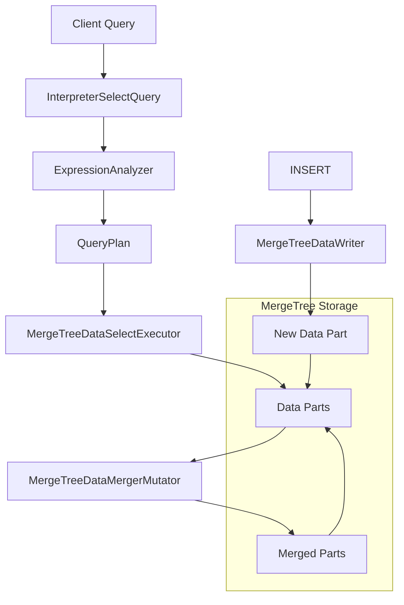

ClickHouse is a column-oriented database management system designed for online analytical processing (OLAP). Its architecture is built around several key principles that enable exceptional query performance on large datasets.

## Core Architecture Principles

### Column-Oriented Storage

Unlike traditional row-oriented databases, ClickHouse stores data by columns rather than rows. This design choice provides:

- **Efficient compression**: Similar data types in a column compress better
- **Faster analytical queries**: Only required columns are read from disk
- **Better cache utilization**: Column data is accessed sequentially
- **SIMD optimization**: Vectorized operations on column data

### Merge Tree Architecture

The foundational storage engine in ClickHouse is the `MergeTree` family, implemented in `src/Storages/MergeTree/`. The core class `MergeTreeData` (defined in `src/Storages/MergeTree/MergeTreeData.h`) manages:

- Data parts and their lifecycle
- Background merge operations
- Data mutations and alterations
- Part selection and pruning

<Note>
From `src/Storages/MergeTree/MergeTreeData.h:144-150`:

"Data structure for *MergeTree engines. Merge tree is used for incremental sorting of data. The table consists of several sorted parts. During insertion new data is sorted according to the primary key and is written to the new part. Parts are merged in the background according to a heuristic algorithm."
</Note>

## Key Components

### Storage Layer

The storage layer is built around several key abstractions:

- **`IMergeTreeDataPart`** (`src/Storages/MergeTree/IMergeTreeDataPart.h`): Represents a single immutable data part
- **`MergeTreeData`**: Manages collections of data parts and coordinates background operations
- **`IDataPartStorage`**: Abstraction for part storage on disk
- **`ActiveDataPartSet`** (`src/Storages/MergeTree/ActiveDataPartSet.h`): Tracks active parts and handles part versioning

### Query Processing Layer

Query execution in ClickHouse follows a pipeline-based architecture:

- **`InterpreterSelectQuery`** (`src/Interpreters/InterpreterSelectQuery.h`): Main entry point for SELECT query execution
- **`ExpressionAnalyzer`** (`src/Interpreters/ExpressionAnalyzer.h`): Analyzes and transforms query expressions
- **`QueryPlan`** (`src/Processors/QueryPlan/QueryPlan.h`): Tree of query steps that builds the execution pipeline
- **`MergeTreeDataSelectExecutor`** (`src/Storages/MergeTree/MergeTreeDataSelectExecutor.h`): Executes SELECT queries on MergeTree data

<Info>
The query plan is a tree of steps that allows for pipeline-level optimizations before actual execution begins.
</Info>

### Background Operations

ClickHouse performs several critical operations in the background:

- **Merges**: Combining smaller parts into larger ones (handled by `MergeTreeDataMergerMutator`)
- **Mutations**: Applying ALTER UPDATE/DELETE operations
- **Moves**: Relocating parts between storage tiers
- **Cleanups**: Removing obsolete parts

These operations are coordinated by `BackgroundJobsAssignee` (`src/Storages/MergeTree/BackgroundJobsAssignee.h`).

## Architecture Diagram

## Data Flow

### Write Path

1. **Data arrives** via INSERT query
2. **Sorting** according to primary key (ORDER BY clause)
3. **Part creation** as an immutable sorted chunk
4. **Part registration** in `ActiveDataPartSet`
5. **Background merging** combines small parts into larger ones

### Read Path

1. **Query parsing** and analysis
2. **Part selection** based on partition and primary key conditions
3. **Mark range filtering** using primary key index
4. **Parallel reading** from selected parts
5. **Merging** sorted streams from multiple parts
6. **Expression evaluation** and aggregation

## Key Design Decisions

### Immutable Parts

Data parts are immutable once written. Modifications create new parts rather than updating existing ones. This design:

- Simplifies concurrent access (no locks needed for reads)
- Enables efficient background merges
- Facilitates replication and backup

### Sparse Primary Index

ClickHouse uses a sparse primary index with granularity (typically 8192 rows). The index stores values for every N-th row, not every row. This provides:

- Compact index size (fits in memory)
- Fast range scans
- Efficient multi-column filtering

<Warning>
The primary key in ClickHouse is NOT a uniqueness constraint. It's purely for data organization and query optimization.
</Warning>

### Vectorized Execution

Operations are performed on batches (blocks) of data using SIMD instructions, providing:

- Better CPU cache utilization
- Reduced per-row overhead
- Hardware-level parallelism

## Next Steps

Explore the detailed architecture documentation:

- [Data Storage](/architecture/data-storage) - Column-oriented storage and MergeTree internals
- [Query Execution](/architecture/query-execution) - Query processing pipeline and optimization
- [Distributed Queries](/architecture/distributed-queries) - Distributed table architecture and sharding
- [Replication](/architecture/replication) - Replication mechanisms and ReplicatedMergeTree
