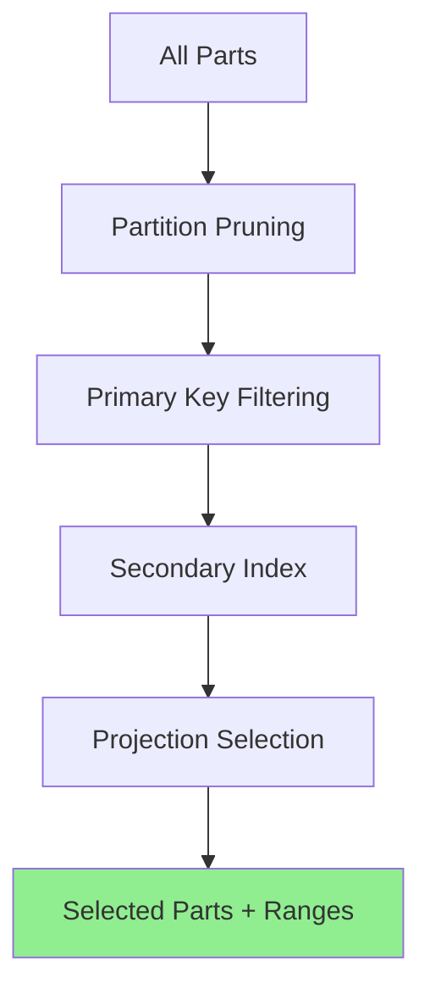
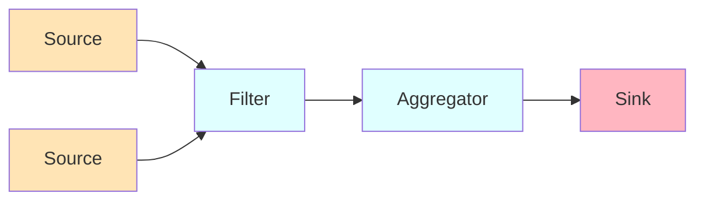

ClickHouse uses a sophisticated query execution architecture based on a pipeline model with extensive optimization capabilities. The system transforms SQL queries into efficient execution plans through multiple stages.

## Query Processing Overview

The query execution flow follows these main stages:

1. **Parsing**: SQL text to AST (Abstract Syntax Tree)
2. **Analysis**: Semantic analysis and expression rewriting
3. **Planning**: Building a query plan with optimization
4. **Execution**: Pipeline-based parallel execution

```mermaid
flowchart LR
    SQL[SQL Query] --> Parser[Parser]
    Parser --> AST[AST]
    AST --> TreeRewriter[TreeRewriter]
    TreeRewriter --> Analyzer[ExpressionAnalyzer]
    Analyzer --> Planner[QueryPlan Builder]
    Planner --> Plan[QueryPlan]
    Plan --> Optimizer[Optimizer]
    Optimizer --> Pipeline[QueryPipeline]
    Pipeline --> Execution[Parallel Execution]
    Execution --> Result[Result]
```



## Query Interpretation

### InterpreterSelectQuery

The `InterpreterSelectQuery` class (`src/Interpreters/InterpreterSelectQuery.h`) is the main entry point for SELECT query execution:

```cpp
// From src/Interpreters/InterpreterSelectQuery.h:40-42
/** Interprets the SELECT query. Returns the stream of blocks with the results
  * of the query before `to_stage` stage.
  */
class InterpreterSelectQuery : public IInterpreterUnionOrSelectQuery
```

Key responsibilities:

- Coordinate all stages of query execution
- Build the query plan
- Handle subqueries and CTEs (Common Table Expressions)
- Manage query context and settings

### Constructor Options

The interpreter supports multiple construction modes (`src/Interpreters/InterpreterSelectQuery.h:55-88`):

- **From AST**: Standard query execution
- **From prepared pipe**: Reading from already-prepared data source
- **From storage**: Direct execution on a specific table
- **With prepared sets**: Reusing sets for projections

<Note>
The ability to reuse prepared sets is important for projection queries, allowing efficient sharing of computed sets.
</Note>

## Expression Analysis

### ExpressionAnalyzer

The `ExpressionAnalyzer` class (`src/Interpreters/ExpressionAnalyzer.h`) performs semantic analysis:

```cpp
// From src/Interpreters/ExpressionAnalyzer.h:58-59
/// ExpressionAnalyzer sources, intermediates and results.
struct ExpressionAnalyzerData
```

It tracks:

- **Column transformations**: Through ARRAY JOIN, JOIN, aggregation, and window functions
- **Prepared sets**: For IN and JOIN operations
- **Aggregation state**: Keys and aggregate functions
- **Window functions**: Definitions and ordering

Key data flow (`src/Interpreters/ExpressionAnalyzer.h:68-76`):

1. `source_columns` → ARRAY JOIN → `columns_after_array_join`
2. → JOIN → `columns_after_join`
3. → Aggregation → `aggregated_columns`
4. → Window Functions → `columns_after_window`

### TreeRewriter

Before expression analysis, the `TreeRewriter` (`src/Interpreters/TreeRewriter.h`) performs:

- Name resolution
- Alias expansion
- Type checking
- Syntax transformations

Produces `TreeRewriterResult` used by the analyzer.

## Query Planning

### QueryPlan

The `QueryPlan` class (`src/Processors/QueryPlan/QueryPlan.h`) represents the execution plan as a tree of steps:

```cpp
// From src/Processors/QueryPlan/QueryPlan.h:72-75
/// A tree of query steps.
/// The goal of QueryPlan is to build QueryPipeline.
/// QueryPlan let delay pipeline creation which is helpful for pipeline-level optimizations.
class QueryPlan
```

Benefits of delayed pipeline creation:

- **Optimization opportunities**: Can transform the plan before execution
- **Better resource estimation**: Know full query structure before starting
- **Projection pushdown**: Select optimal projections
- **Predicate pushdown**: Move filters closer to data source

### Query Plan Steps

Each step in the plan represents an operation:

- **ReadFromMergeTree**: Read data from MergeTree tables
- **FilterStep**: Apply WHERE conditions
- **AggregatingStep**: Perform GROUP BY aggregation
- **SortingStep**: Sort data
- **LimitStep**: Apply LIMIT clause
- **ExpressionStep**: Evaluate expressions

Steps are connected in a tree structure, where each step's output becomes input to its parent.

## MergeTree Query Execution

### MergeTreeDataSelectExecutor

The `MergeTreeDataSelectExecutor` class (`src/Storages/MergeTree/MergeTreeDataSelectExecutor.h`) executes SELECT queries on MergeTree tables:

```cpp
// From src/Storages/MergeTree/MergeTreeDataSelectExecutor.h:22-24
/** Executes SELECT queries on data from the merge tree.
  */
class MergeTreeDataSelectExecutor
```

Main entry point (`src/Storages/MergeTree/MergeTreeDataSelectExecutor.h:35-43`):

```cpp
QueryPlanPtr read(
    const Names & column_names,
    const StorageSnapshotPtr & storage_snapshot,
    const SelectQueryInfo & query_info,
    ContextPtr context,
    UInt64 max_block_size,
    size_t num_streams,
    PartitionIdToMaxBlockPtr max_block_numbers_to_read = nullptr,
    bool enable_parallel_reading = false) const;
```

### Part Selection

The executor performs intelligent part selection:

1. **Partition pruning**: Eliminate partitions based on partition key
2. **Primary key filtering**: Use primary key index to select mark ranges
3. **Secondary index application**: Apply skip indexes (bloom filter, minmax, etc.)
4. **Projection selection**: Choose optimal projection if available



### Mark Range Filtering

The `markRangesFromPKRange` method (`src/Storages/MergeTree/MergeTreeDataSelectExecutor.h:73-80`) converts primary key conditions to mark ranges:

- Uses `KeyCondition` to evaluate primary key predicates
- Produces `MarkRanges`: sequences of granule ranges to read
- Minimizes data reading by skipping irrelevant granules

<Info>
Mark ranges represent the minimal set of granules that must be read to satisfy the query conditions.
</Info>

### Estimation

Before execution, the system estimates resource usage (`src/Storages/MergeTree/MergeTreeDataSelectExecutor.h:63-71`):

```cpp
ReadFromMergeTree::AnalysisResultPtr estimateNumMarksToRead(
    RangesInDataParts parts,
    const Names & column_names,
    const StorageMetadataPtr & metadata_snapshot,
    const SelectQueryInfo & query_info,
    ContextPtr context,
    size_t num_streams) const;
```

This is crucial for:
- Projection selection (choose projection with least reads)
- Resource allocation
- Query planning decisions

## Pipeline Execution

### QueryPipeline

The `QueryPipeline` converts the plan into executable processors:

- **Processors**: Independent units of computation
- **Ports**: Connect processors (input/output ports)
- **Parallel execution**: Multiple processor instances run concurrently

### Processor Model

Key processor types:

- **Sources**: Generate data (e.g., read from disk)
- **Transforms**: Process data (e.g., filter, aggregate)
- **Sinks**: Consume data (e.g., write to client, materialize)

Processors communicate through ports using a pull-based model:



## Optimization Techniques

### Predicate Pushdown

Filters are pushed down as close to the data source as possible:

- **Storage-level**: Partition and primary key filtering
- **Part-level**: Skip indexes
- **Granule-level**: PREWHERE optimization

<Note>
From `src/Storages/StorageDistributed.h:82-84`:

"Do not apply moving to PREWHERE optimization for distributed tables, because we can't be sure that underlying table supports PREWHERE."
</Note>

### PREWHERE Optimization

PREWHERE is a ClickHouse-specific optimization:

1. Read only columns needed for WHERE condition
2. Evaluate condition to create a filter
3. Read remaining columns only for matching rows

Benefits:
- Reduces data read from disk
- Lowers memory usage
- Faster query execution for selective filters

### Projection Pushdown

Projections (materialized views) can be automatically selected:

1. Analyze query requirements
2. Estimate cost for each available projection
3. Choose projection with minimum estimated cost
4. Rewrite query to use selected projection

Implemented in projection selection logic within query planning.

### Index Usage

#### Primary Key Index

- Stored in memory (loaded from `primary.idx`)
- Used by `KeyCondition` class to evaluate range predicates
- Sparse index: one entry per granule

#### Secondary Indexes

Skip indexes provide additional filtering:

- **minmax**: Min/max values per granule
- **bloom_filter**: Bloom filter for set membership
- **tokenbf_v1**: Token bloom filter for text search
- **ngrambf_v1**: N-gram bloom filter
- **set**: Unique value sets

Managed by `MergeTreeIndices` (`src/Storages/MergeTree/MergeTreeIndices.h`).

## Aggregation

### Aggregation Pipeline

For GROUP BY queries:

1. **Partial aggregation**: Each stream aggregates independently
2. **Merging**: Combine partial results
3. **Finalization**: Compute final aggregate values

Two-level aggregation is used for large result sets:
- First level: Hash-based local aggregation
- Second level: Merge buckets by hash

### Aggregate Function States

Aggregate functions maintain state during computation:

- **State**: Intermediate computation state
- **Merge**: Combine states from different streams
- **Finalize**: Produce final result

Defined by `AggregateDescription` (`src/Interpreters/AggregateDescription.h`).

## Parallelism

### Parallel Reading

MergeTree tables support parallel reading:

- Multiple threads read different mark ranges
- Coordinated through `IMergeTreeReadPool` (`src/Storages/MergeTree/IMergeTreeReadPool.h`)
- Dynamic work distribution for load balancing

### Thread Pool Management

Different thread pools for different operations:

- **Query execution threads**: Process data
- **Background operations**: Merges, mutations, moves
- **Distributed queries**: Network communication

Managed through `BackgroundSchedulePool` and thread pool callback runners.

## Join Execution

JOIN operations use specialized algorithms:

- **Hash join**: For equi-joins
- **Sorted merge join**: For large sorted inputs
- **Direct join**: For distributed tables
- **Full sorting merge join**: For FULL OUTER JOIN

Join algorithm selection is automatic based on:
- Join type (INNER, LEFT, RIGHT, FULL)
- Data size estimates
- Available memory
- Sort order of inputs

## Window Functions

Window functions are executed in a separate pipeline stage:

1. **Partition**: Group rows by PARTITION BY clause
2. **Sort**: Order within partitions by ORDER BY clause
3. **Compute**: Apply window function

Managed by `WindowDescription` (`src/Interpreters/WindowDescription.h`).

## Query Optimization Settings

Key settings that affect query execution:

- `max_threads`: Maximum parallel threads
- `max_block_size`: Block size for processing
- `max_rows_to_read`: Limit rows read
- `optimize_move_to_prewhere`: Enable PREWHERE optimization
- `optimize_read_in_order`: Read in primary key order
- `use_index_for_in_with_subqueries`: Use index for IN subqueries

These are accessed through `ExpressionActionsSettings` (`src/Interpreters/ExpressionActionsSettings.h`).

## Related Source Files

- `src/Interpreters/InterpreterSelectQuery.h` - Main query interpreter
- `src/Interpreters/ExpressionAnalyzer.h` - Expression analysis
- `src/Processors/QueryPlan/QueryPlan.h` - Query plan representation
- `src/Storages/MergeTree/MergeTreeDataSelectExecutor.h` - MergeTree execution
- `src/Interpreters/ActionsDAG.h` - Expression DAG for optimization
