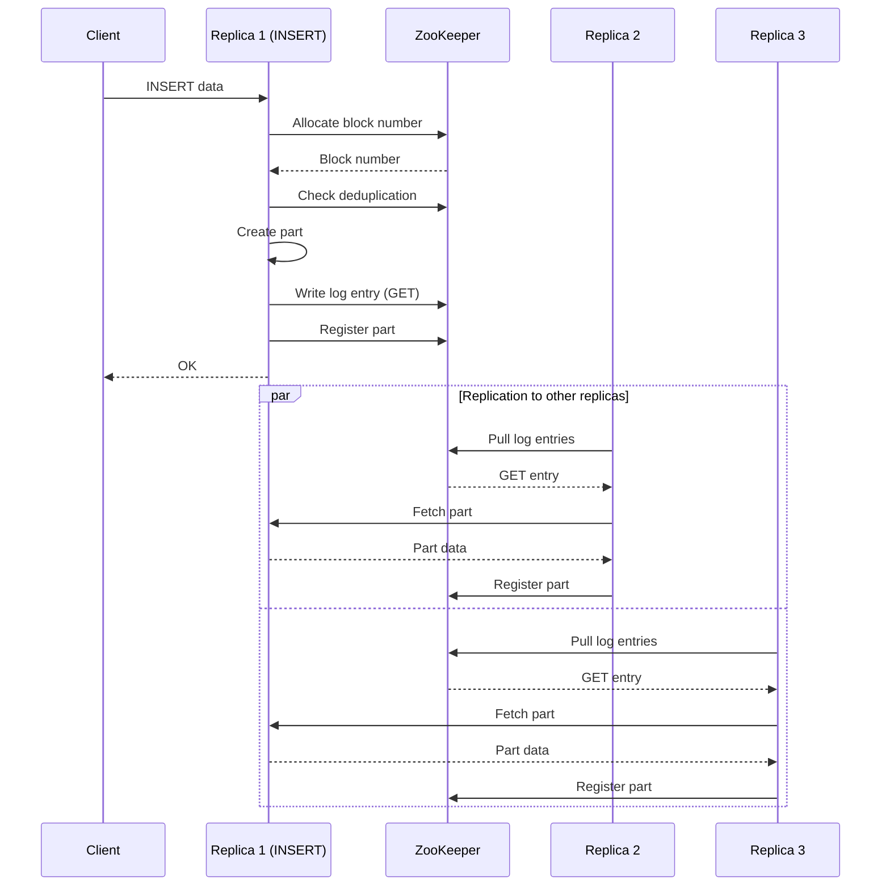

ClickHouse implements table-level replication through the `ReplicatedMergeTree` engine family. Replication ensures data redundancy, high availability, and consistency across multiple replicas using Apache ZooKeeper for coordination.

## ReplicatedMergeTree Overview

### Purpose and Design

The `StorageReplicatedMergeTree` class (`src/Storages/StorageReplicatedMergeTree.h`) extends `MergeTreeData` with replication capabilities:

```cpp
// From src/Storages/StorageReplicatedMergeTree.h:52-68
/** The engine that uses the merge tree (see MergeTreeData) and is replicated through ZooKeeper.
  *
  * ZooKeeper is used for the following things:
  * - the structure of the table (/metadata, /columns)
  * - action log with data (/log/log-...,/replicas/replica_name/queue/queue-...);
  * - a replica list (/replicas), and replica activity tag (/replicas/replica_name/is_active),
  *   replica addresses (/replicas/replica_name/host);
  * - the leader replica election (/leader_election)
  * - a set of parts of data on each replica (/replicas/replica_name/parts);
  * - list of the last N blocks of data with checksum, for deduplication (/blocks);
  * - the list of incremental block numbers (/block_numbers)
  * - coordinate writes with quorum (/quorum).
  * - Storage of mutation entries (ALTER DELETE, ALTER UPDATE etc.) to execute (/mutations).
  */
class StorageReplicatedMergeTree final : public MergeTreeData
```

<Info>
Replication is at the table level, not server level. Different tables can have different replication topologies.
</Info>

## ZooKeeper Coordination

### ZooKeeper Structure

Each replicated table has a ZooKeeper path structure:

```
/clickhouse/tables/{shard}/{table_name}/
├── metadata                    # Table structure
├── columns                     # Column definitions
├── replicas/
│   ├── replica1/
│   │   ├── is_active          # Replica status
│   │   ├── host               # Replica address
│   │   ├── parts/             # Parts this replica has
│   │   └── queue/             # Operations to execute
│   └── replica2/
│       └── ...
├── log/                       # Global operation log
│   ├── log-0000000001
│   ├── log-0000000002
│   └── ...
├── leader_election/           # Leader coordination
├── blocks/                    # Deduplication info
├── block_numbers/             # Block number allocation
├── mutations/                 # Mutation operations
└── quorum/                    # Quorum write tracking
```

### ZooKeeper Usage

From the source documentation (`src/Storages/StorageReplicatedMergeTree.h:54-66`):

1. **Metadata**: Table structure stored in `/metadata` and `/columns`
2. **Action log**: Replication operations in `/log/log-...`
3. **Replica list**: Active replicas in `/replicas`
4. **Leader election**: Coordinated through `/leader_election`
5. **Part registry**: Each replica registers parts in `/replicas/{name}/parts`
6. **Deduplication**: Block checksums in `/blocks`
7. **Block numbers**: Sequential insert tracking in `/block_numbers`
8. **Quorum**: Write acknowledgment in `/quorum`
9. **Mutations**: DDL operations in `/mutations`

## Replication Log

### Log Entry Types

The replication log contains entries defined in `ReplicatedMergeTreeLogEntry` (`src/Storages/MergeTree/ReplicatedMergeTreeLogEntry.h`):

```cpp
// From src/Storages/StorageReplicatedMergeTree.h:70-76
/** Each entry is one of:
  * - normal data insertion (GET),
  * - data insertion with a possible attach from local data (ATTACH),
  * - merge (MERGE),
  * - delete the partition (DROP).
  */
```

Entry types:

- **GET**: Fetch a part from another replica
- **ATTACH**: Attach a part if available locally, otherwise fetch
- **MERGE**: Merge specified parts
- **DROP_RANGE**: Drop a partition or part range
- **MUTATE_PART**: Apply mutation to a part
- **ALTER_METADATA**: Change table structure

### Log Processing

From `src/Storages/StorageReplicatedMergeTree.h:78-94`:

1. Replicas copy log entries to local queue (`pullLogsToQueue`)
2. Queue entries are executed (`queueTask`)
3. Execution can be reordered if beneficial (`shouldExecuteLogEntry`)
4. Entries may be generated independently (not from log):
   - GET entries created during replica initialization
   - GET entries for corrupt/missing parts

<Note>
Despite being called a "queue", entries can be executed out of order when safe to do so for performance.
</Note>

## Replica Queue

### ReplicatedMergeTreeQueue

The `ReplicatedMergeTreeQueue` class (`src/Storages/MergeTree/ReplicatedMergeTreeQueue.h`) manages the execution queue:

```cpp
// From src/Storages/MergeTree/ReplicatedMergeTreeQueue.h:86-97
/// Protects the queue, future_parts and other queue state variables.
mutable std::mutex state_mutex;

/// A set of parts that should be on this replica according to the queue entries
/// that have been done up to this point. The invariant holds:
/// `virtual_parts` = `current_parts` + `queue`.
ActivateDataPartSet current_parts;

/** The queue of what you need to do on this line to catch up. It is taken from
  * ZooKeeper (/replicas/me/queue/). In ZK records in chronological order.
  * Here they are executed in parallel and reorder after entry execution.
  */
Queue queue;
```

Key invariant (`src/Storages/MergeTree/ReplicatedMergeTreeQueue.h:88-91`):

```
virtual_parts = current_parts + queue
```

This means the virtual state includes both existing parts and parts that will exist after queue execution.

### Queue Operations

The queue tracks (`src/Storages/MergeTree/ReplicatedMergeTreeQueue.h:64-69`):

```cpp
struct OperationsInQueue
{
    size_t merges = 0;
    size_t mutations = 0;
    size_t merges_with_ttl = 0;
};
```

## Data Insertion

### Insert Process

When data is inserted into a replicated table:

1. **Block number allocation**: Get unique block number from `/block_numbers`
2. **Deduplication check**: Check if block was already inserted (using `/blocks`)
3. **Part creation**: Write data part locally
4. **Log entry**: Add GET entry to replication log
5. **Part registration**: Register part in ZooKeeper
6. **Replication**: Other replicas fetch the part



### Deduplication

ClickHouse deduplicates inserts based on block checksums:

- Block checksum stored in `/blocks` ZNode
- Stored for last N blocks (configurable)
- Prevents duplicate inserts of the same data
- Works across replicas

<Warning>
Deduplication only works for identical INSERT queries. Different queries producing the same data will not be deduplicated.
</Warning>

## Data Fetching

### Part Exchange

Parts are transferred between replicas using `DataPartsExchange` protocol (`src/Storages/MergeTree/DataPartsExchange.h`):

1. **Request**: Replica requests part by name
2. **Validation**: Source validates it has the part
3. **Transfer**: Stream part files over network
4. **Checksum**: Verify checksums after transfer
5. **Activation**: Make part active on destination

Managed by `ReplicatedFetchList` (`src/Storages/MergeTree/ReplicatedFetchList.h`).

### Fetch Strategies

- **From replicas**: Fetch from other replicas in same shard
- **From any replica**: Fetch from any replica if allowed
- **Parallel fetch**: Multiple parts fetched concurrently

## Merge Coordination

### Leader Election

Multiple leaders can coordinate merges concurrently (since version 20.5):

- Leaders are elected through `/leader_election`
- Leaders can initiate merges and mutations
- Non-leaders execute assigned operations

### Merge Predicate

`ReplicatedMergeTreeMergePredicate` (`src/Storages/MergeTree/Compaction/MergePredicates/ReplicatedMergeTreeMergePredicate.h`) ensures safe merges:

- Checks parts are available across replicas
- Prevents merging parts being currently fetched
- Coordinates with ongoing mutations
- Considers quorum requirements

Related to `DistributedMergePredicate` (`src/Storages/MergeTree/Compaction/MergePredicates/DistributedMergePredicate.h`) for cross-replica coordination.

### Merge Strategy

`ReplicatedMergeTreeMergeStrategyPicker` (`src/Storages/MergeTree/ReplicatedMergeTreeMergeStrategyPicker.h`) selects merge strategy:

- **Local**: Execute merge locally
- **Remote**: Fetch merged part from another replica
- Decision based on available resources and part availability

## Mutations

### Mutation Propagation

ALTER UPDATE/DELETE operations are mutations:

1. **Mutation entry**: Created in `/mutations`
2. **Version assignment**: Each mutation gets a version
3. **Execution**: Applied to each part independently
4. **Coordination**: All replicas must apply mutations
5. **Completion**: Tracked until all replicas finish

Managed by `ReplicatedMergeTreeMutationEntry` (`src/Storages/MergeTree/ReplicatedMergeTreeMutationEntry.h`).

### Mutation Status

Mutation progress tracked by `MergeTreeMutationStatus` (`src/Storages/MergeTree/MergeTreeMutationStatus.h`):

- Parts completed
- Parts remaining
- Failed attempts
- Error messages

## Background Threads

### Key Threads

ReplicatedMergetre runs several background threads:

- **`ReplicatedMergeTreeQueue`**: Processes queue entries
- **`ReplicatedMergeTreeRestartingThread`** (`src/Storages/MergeTree/ReplicatedMergeTreeRestartingThread.h`): Monitors ZooKeeper, restarts operations
- **`ReplicatedMergeTreeCleanupThread`** (`src/Storages/MergeTree/ReplicatedMergeTreeCleanupThread.h`): Removes old log entries and blocks
- **`ReplicatedMergeTreePartCheckThread`** (`src/Storages/MergeTree/ReplicatedMergeTreePartCheckThread.h`): Verifies part integrity
- **`ReplicatedMergeTreeAttachThread`** (`src/Storages/MergeTree/ReplicatedMergeTreeAttachThread.h`): Attaches table during startup

### Thread Coordination

Threads coordinate through:
- Shared state protected by mutexes
- ZooKeeper watches for changes
- Event notifications for state changes

## Consistency Guarantees

### Quorum Writes

Optional quorum inserts ensure durability:

```sql
INSERT INTO table VALUES (...) SETTINGS insert_quorum=2;
```

- Waits for N replicas to acknowledge insert
- Tracked in `/quorum` ZNode
- Ensures data survives replica failures
- Performance impact due to synchronous waiting

<Info>
Quorum writes provide stronger durability guarantees but reduce insert performance. Use for critical data.
</Info>

### Linearizability

ReplicatedMergeTree provides:

- **Sequential consistency**: Inserts are ordered
- **Eventual consistency**: All replicas converge
- **Read-your-writes**: After quorum insert, data visible on all replicas

### Replica Synchronization

`SYNC REPLICA` command defined by `SyncReplicaMode` (`src/Parsers/SyncReplicaMode.h`):

```sql
SYSTEM SYNC REPLICA table_name;
```

Modes:
- **STRICT**: Wait for all queue entries
- **LIGHTWEIGHT**: Wait for specific operations
- **PULL**: Just pull log entries, don't execute

## Failure Handling

### Replica Recovery

When a replica comes back online:

1. **Attach thread**: Initializes replica state
2. **Pull logs**: Fetch missed log entries from ZooKeeper
3. **Compare parts**: Identify missing/extra parts
4. **Fetch missing**: Download missing parts
5. **Remove extra**: Delete obsolete parts
6. **Execute queue**: Process pending operations

Handled by `ReplicatedMergeTreeAttachThread`.

### Part Corruption

If a part is detected as corrupt:

1. **Detection**: Checksum mismatch or read error
2. **Queue entry**: Create GET entry to refetch
3. **Fetch**: Download part from healthy replica
4. **Replace**: Replace corrupt part with good one

Managed by `ReplicatedMergeTreePartCheckThread`.

### ZooKeeper Connection Loss

If ZooKeeper connection is lost:

- Table becomes read-only
- No new inserts accepted
- Existing data remains queryable
- Operations resume when connection restored

Monitored by `ReplicatedMergeTreeRestartingThread`.

## Advanced Features

### Alter Sequence

`ReplicatedMergeTreeAltersSequence` (`src/Storages/MergeTree/ReplicatedMergeTreeAltersSequence.h`) coordinates schema changes:

- Tracks ALTER operations
- Ensures correct order of execution
- Handles conflicts between concurrent ALTERs

### Replica Status

`ReplicatedTableStatus` (`src/Storages/MergeTree/ReplicatedTableStatus.h`) provides:

- Queue length
- Replication delay
- Parts to fetch
- Active operations

Queryable via `system.replicas` table.

### Address Management

`ReplicatedMergeTreeAddress` (`src/Storages/MergeTree/ReplicatedMergeTreeAddress.h`) stores:

- Host and port for replica
- Database and table name
- Used for inter-replica communication

## Monitoring Replication

### System Tables

- **`system.replicas`**: Replica status and lag
- **`system.replication_queue`**: Queue contents and execution
- **`system.mutations`**: Mutation progress
- **`system.replicated_fetches`**: Active part transfers

### Key Metrics

- **Replication delay**: Time between insert and replication
- **Queue length**: Number of pending operations
- **Active fetches**: Parts currently being transferred
- **Failed operations**: Operations that encountered errors

## Best Practices

### Replica Configuration

- Use at least 2 replicas for high availability
- Place replicas in different availability zones
- Ensure sufficient network bandwidth between replicas
- Monitor ZooKeeper health and performance

### Performance Optimization

- Batch inserts to reduce replication overhead
- Use async inserts for high throughput (trade-off: potential data loss)
- Configure `max_replicated_fetches_network_bandwidth` to limit network usage
- Adjust `background_fetches_pool_size` based on workload

### Troubleshooting

- Check `system.replication_queue` for stuck operations
- Monitor ZooKeeper logs for connection issues
- Verify network connectivity between replicas
- Use `SYSTEM RESTART REPLICA` to reset replica state
- Check part checksums with `CHECK TABLE`

## Related Source Files

- `src/Storages/StorageReplicatedMergeTree.h` - Main replication implementation
- `src/Storages/MergeTree/ReplicatedMergeTreeQueue.h` - Operation queue management
- `src/Storages/MergeTree/ReplicatedMergeTreeLogEntry.h` - Log entry definitions
- `src/Storages/MergeTree/DataPartsExchange.h` - Part transfer protocol
- `src/Storages/MergeTree/ReplicatedMergeTreeMergeStrategyPicker.h` - Merge strategy selection
